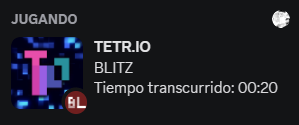
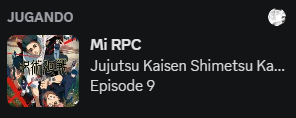
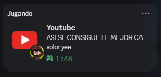
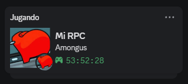

# Discord RPC Multi-Activity Bridge

Discord Rich Presence for multiple activities: TETR.IO, anime, Roblox, and custom statuses.

Based on [TETRIO-browser-rpc](https://github.com/PATXS/TETRIO-browser-rpc) by PATXS.

**[Versión en español](README.md)**

## What it does

Shows what you're doing on your Discord profile — playing TETR.IO, watching anime, playing Roblox, or a custom status. Only one activity is shown at a time (the highest priority one).

| Activity        | Preview                            |
| --------------- | ---------------------------------- |
| TETR.IO         |         |
| Anime           |             |
| YouTube         |         |
| Roblox (Rivals) |  |
| Custom Status   |           |

You don't need to use all features. Just install the userscripts you want.

## Installation

1. **[Download the ZIP](https://github.com/ema28pro/Multiple-Rich-Presence-Custom/archive/refs/heads/release.zip)** (`release` branch — only the necessary files)
2. Extract the ZIP to any folder
3. Done — you can now run `DiscordPipeSocket.jar`

The ZIP contains:
- `DiscordPipeSocket.jar` — the bridge
- `config.json` — configuration
- `custom-status/` — custom status panel
- `userscripts/` — Tampermonkey scripts

## Requirements

- **Java 8+** installed
- **Discord** open (desktop app)
- **Tampermonkey** in your browser ([Chrome](https://chrome.google.com/webstore/detail/tampermonkey/dhdgffkkebhmkfjojejmpbldmpobfkfo) / [Firefox](https://addons.mozilla.org/en-US/firefox/addon/tampermonkey/) / [Edge](https://microsoftedge.microsoft.com/addons/detail/tampermonkey/iikmkjmpaadaobahmlepeloendndfphd)) — only if using userscripts

## Usage

### 1. Run the bridge

Double-click `DiscordPipeSocket.jar`. It runs silently in the background with a system tray icon.

It needs to be running while you use any of the features. Run it once and forget about it. If you want it to start with Windows, create a **shortcut** to the `.jar` and place it in `%appdata%\Microsoft\Windows\Start Menu\Programs\Startup` (don't move the JAR — it needs `config.json` and `bridge-state.json` in the same folder).

### 2. Install userscripts (pick what you want)

With Tampermonkey installed:

- **TETR.IO** → Install `userscripts/TETRIO-RPC.js`
- **Anime** → Install `userscripts/Anime-RPC.js`
- **YouTube** → Install `userscripts/YouTube-RPC.js`

To install: open Tampermonkey → New script → paste the file contents → Save.

Only install the ones you need. If you only care about TETRIO, skip the anime one and vice versa.

> **Note:** **YouTube-RPC:** Works on any video, playlist or channel. If you use AnimeFLV, the adblocker may block the script.  
> If you switch between pages with different userscripts, errors may occur. If the RPC doesn't update, reload the page.

### 3. Roblox (automatic)

The bridge automatically detects when you're playing Roblox from the game's logs. No extra setup needed.

> **Important:** For the Rivals status to show up, you must **disable Discord's built-in Roblox detection** in Settings → Registered Games → toggle off Roblox. Otherwise Discord shows its own activity instead of the bridge's.

For now it only detects and shows **Rivals**, but support for any Roblox game is planned for the future.

### 4. Custom Status (optional)

Right-click the system tray icon → **Custom Status**. A browser panel opens where you can set a custom status with images, text, and a timer.

## Configuration

The `config.json` file comes pre-configured and ready to use. You only need to change it if you want to customize the app name shown in Discord.

```json
{
  "clientId": "1479761532412887040",
  "tetrioClientId": "688741895307788290",
  "wsPort": 6680,
  "sourceTimeout": 15000
}
```

### Changing the name shown in Discord

By default it shows "Playing **[app name]**" on your profile. If you want a different name:

1. Go to https://discord.com/developers/applications
2. Create a **New Application** — the name you give it is what will show up in Discord
3. Copy the **Application ID** and set it as `clientId` in `config.json`

The `tetrioClientId` is already set to the official TETR.IO app (which has the mode icons). Don't change it unless you know what you're doing.

## Firefox

If you're using Firefox, go to `about:config` and set `network.websocket.allowInsecureFromHTTPS` to `true`.

## Troubleshooting

- **RPC not showing**: Make sure `DiscordPipeSocket.jar` is running and Discord is open.
- **Roblox not detected**: The bridge needs Roblox to finish loading the game. Wait a few seconds.
- **Custom status activates by itself**: Close any old custom status panel tabs in your browser.
- **YouTube-RPC doesn't work on AnimeFLV**: Disable the adblocker so the script can connect.
- **Errors when switching between userscripts**: If the status doesn't update, reload the page.

## Credits

- [PATXS](https://github.com/PATXS) — Original TETRIO-browser-rpc project
- [Jinzulen](https://github.com/Jinzulen) — Mangadex-RPC (DiscordPipeSocket base)

---

⭐ If you find this useful, a star on the repo is appreciated.

Got suggestions, recommendations, or ideas for new features (like a YouTube RPC)? Open an issue!
